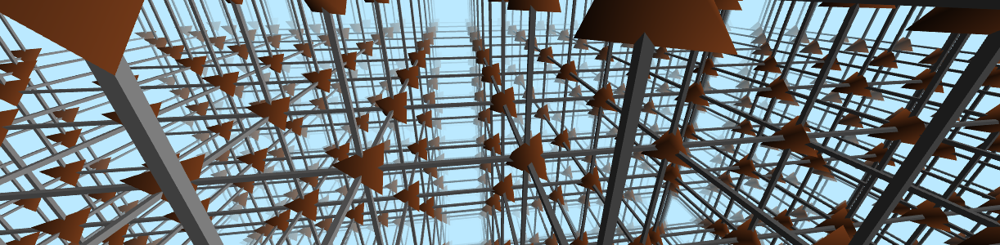

Run `node examples/simple.js`. The script will procedurally create geometrical scenes for a set of hashes.

E.g. the hash  3e7398b93eb529004e1c67a2d28fced849ee1bb76e7391b results in this image:

Based on my earlier project: https://github.com/mdvanes/ImpossibleObjects/tree/gh-pages/kubische_ruimteverdeling

Because it does not seem possible to run Three.js directly in Node, I use Puppeteer to start a Chrome instance and
run the script there. Since this only uses one specific version of Chrome, I use ES6 syntax and native modules without
transpilation.